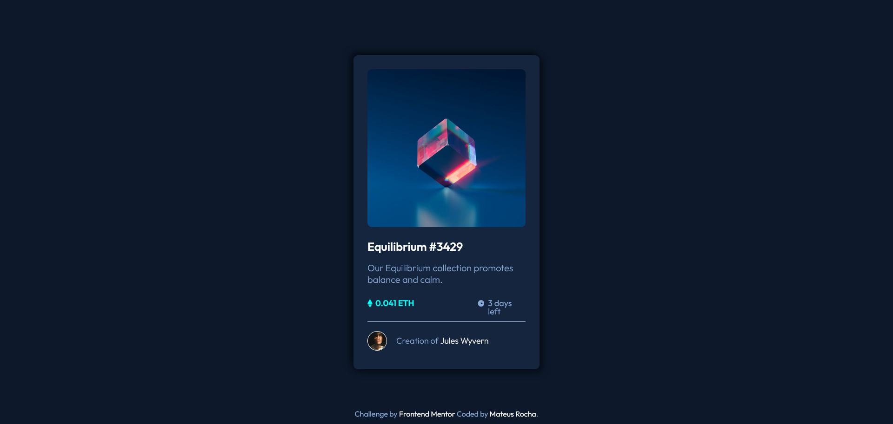

# Frontend Mentor - NFT preview card component solution

Hello 👋 

This is a solution to the [NFT preview card component challenge on Frontend Mentor](https://www.frontendmentor.io/challenges/nft-preview-card-component-SbdUL_w0U). Frontend Mentor challenges help you improve your coding skills by building realistic projects. 

## Table of contents

  - [Overview](#overview) 
  - [Screenshot](#screenshot)
  - [Links](#links)
  - [Built with](#built-with)
  - [Useful resources](#useful-resources)
  - [Author](#author)

## Overview

This is my second challenge on Frontend Mentor. 

### Screenshot

### Links 

[live Site](https://mateus-lr.github.io/QR-code-component-challenge-on-Frontend-Mentor/)

### Built with

- Semantic HTML5 markup
- CSS custom properties
- Mobile-first workflow
- Responsive CSS
- Flexbox
- :hover selector

### Useful resources

- [:hover Selector](https://www.w3schools.com/cssref/sel_hover.asp) - This helped me to use the :hover selector.

## Author

- Website - [Mateus Rocha](https://github.com/mateus-lr)
- Frontend Mentor - [@mateus-lr](https://www.frontendmentor.io/profile/mateus-lr)
- Twitter - [@matscript](https://www.twitter.com/maatscript)
